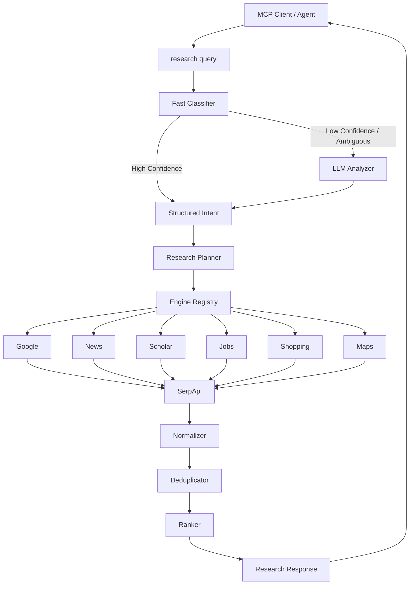

# ResearchRouter MCP

> An intelligent MCP research tool that automatically routes queries to the right SerpApi engine.

**Built for the SerpApi India Hackathon 2026 (Open-Source Integrations Track)**

---

## 🎯 The Problem

When an LLM agent needs to research something, it faces **tool-selection complexity**: which search engine should it use? Google? News? Scholar? Jobs? Shopping? Maps?

Exposing every single SerpApi engine as a separate MCP tool forces the agent to make routing decisions it shouldn't need to make, wasting context window and increasing latency.

## 🚀 The Solution

ResearchRouter exposes **one** unified MCP tool — `research(query)` — that automatically:

1. **Understands** the user's research intent (Domain, Entities, Constraints).
2. **Selects** the right SerpApi engine (`google`, `google_news`, `google_scholar`, `google_jobs`, `google_shopping`, `google_maps`).
3. **Constructs** optimized search queries with extracted filters (e.g., location, date, price).
4. **Executes** one or more searches (concurrently when doing deep research).
5. **Normalizes** results into a unified format.
6. **Deduplicates** and **ranks** them.
7. Returns a clean, LLM-friendly research response.

## 🧠 Hybrid Intelligence Architecture

To minimize latency and cost, ResearchRouter uses a dual-pass routing system:
- **Fast Deterministic Classification**: Uses weighted regular expressions to instantly detect high-confidence domains (e.g., "internships in Chennai" routes to `google_jobs` instantly).
- **LLM Semantic Fallback**: If the query is ambiguous, it falls back to Gemini 2.5 Flash to extract structured intent using Pydantic JSON schemas.



## 🛠️ Supported Domains

| Domain | SerpApi Engine | Example Query |
|--------|---------------|---------------|
| General | `google` | "What is retrieval augmented generation?" |
| News | `google_news` | "Latest AI news" |
| Academic | `google_scholar` | "Research papers about RAG hallucination" |
| Jobs | `google_jobs` | "AI internships in Chennai posted this week" |
| Shopping | `google_shopping` | "RTX laptops under ₹90,000" |
| Places | `google_maps` | "Best cafes near Chennai airport" |

## 💻 Installation

```bash
git clone https://github.com/your-org/research-router-mcp.git
cd research-router-mcp

# Create and activate virtual environment
python -m venv .venv
# Windows
.venv\Scripts\activate
# Linux / macOS
source .venv/bin/activate

# Install with dependencies
pip install -e .
```

## ⚙️ Configuration

Copy `.env.example` to `.env` and configure your API keys:

```bash
cp .env.example .env
```

| Variable | Description |
|----------|-------------|
| `SERPAPI_API_KEY` | Your SerpApi API key (Required) |
| `GOOGLE_API_KEY` | Google AI API key for Gemini LLM fallback (Optional, but recommended) |

See [`docs/configuration.md`](docs/configuration.md) for all options (caching, concurrency, thresholds, Ollama support).

## 🔌 MCP Client Configuration (Claude Desktop / Cursor)

Add the following to your MCP client config (e.g. `claude_desktop_config.json`):

```json
{
  "mcpServers": {
    "research-router": {
      "command": "python",
      "args": ["-m", "research_router"],
      "cwd": "/absolute/path/to/research-router-mcp",
      "env": {
        "SERPAPI_API_KEY": "your_api_key_here",
        "GOOGLE_API_KEY": "your_api_key_here"
      }
    }
  }
}
```

## 🖥️ CLI Usage

You can use the built-in CLI to test routing without an MCP client:

```bash
# Standard search
research-router "Find AI internships in Chennai"

# Debug mode: View the routing plan without executing it
research-router --debug "Latest research papers about RAG hallucination"

# Deep research (executes multiple concurrent searches)
research-router --depth deep "RAG hallucination mitigation techniques"
```

## 🧪 Testing

The project has comprehensive unit testing (145 tests) with full Pydantic model boundary validation, network error recovery, and robust test fixtures.

```bash
pip install -e ".[dev]"
pytest tests/unit/ -v
```

## 📖 Documentation
- [Architecture Details](docs/architecture.md)
- [Adding a New Engine Adapter](docs/adding-engine.md)
- [Usage Examples](docs/examples.md)
- [Configuration](docs/configuration.md)

## 🐳 Docker

A production-ready Dockerfile is included:

```bash
docker build -t research-router-mcp .
docker run -i --env-file .env research-router-mcp
```

