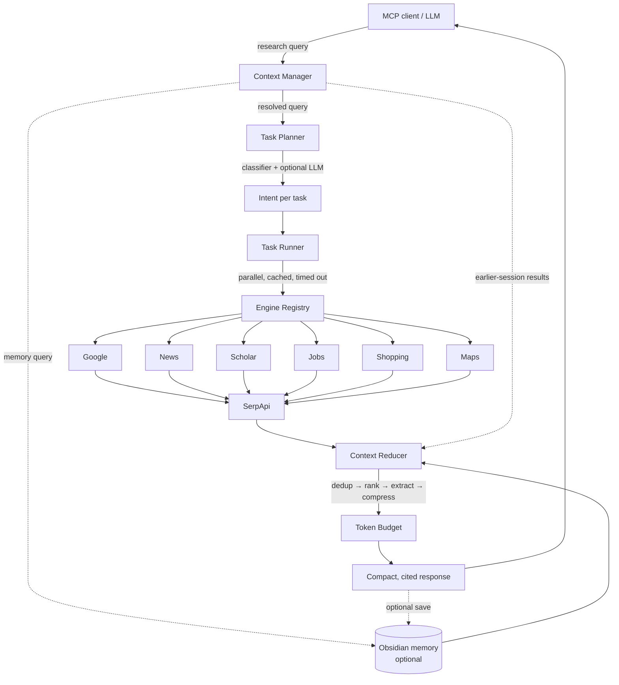

# ResearchRouter MCP

> A context-aware, memory-aware research agent for LLMs, exposed as **one** MCP tool: `research(query)`.

**Built for the SerpApi India Hackathon 2026 (Open-Source Integrations Track)**

---

## 🎯 The Problem

When an LLM agent researches something it has to decide which search engine to use (Google, News, Scholar, Jobs, Shopping or Maps), how many searches to run, and how much of the raw output to put in its context window. Exposing every SerpApi engine as a separate MCP tool pushes those decisions onto the LLM. It wastes tool calls, repeats searches, and floods the context with duplicated snippets and boilerplate.

## 🚀 The Solution

ResearchRouter keeps the interface to **one tool** and does the work internally:

> **Retrieve less, retrieve smarter, remember what matters, run only the necessary tools, and return the smallest useful context.**

| Capability | What it does |
|---|---|
| **Intelligent tool selection** | Works out the intent, splits multi-part requests into tasks, and calls only the engines each task needs |
| **Parallel execution** | Runs independent tasks at the same time; dependent steps (fallbacks, extra searches) run after them |
| **Context-aware follow-ups** | Resolves "those papers", "the second approach", "compare them" and "continue my research" against the session |
| **Context reducer** | Normalises, deduplicates, ranks and filters results, extracts the key sentences, and compresses only as much as needed |
| **Token budget** | Keeps each response within a configurable estimated-token budget (`context_budget`) |
| **Source-aware evidence** | Every claim keeps its title, URL, date and publisher, even after compression |
| **Persistent memory (optional)** | Saves findings to an Obsidian vault and recalls relevant notes later, labelled as old information |
| **Observability** | Debug report, measured per-request metrics, and a side-by-side comparison with the original pipeline |

Example of what happens inside a single call:

```text
"Find recent RAG papers and their GitHub implementations"
  → task t1  find_papers           academic_search (google_scholar)  ┐ run in
  → task t2  find_implementations  github_search   (google)          ┘ parallel
  → merge → dedup → rank → compress to budget → cited evidence
```

## 🧠 Architecture


```mermaid
graph TD
  A[MCP client / LLM] -->|research query| B[Context Manager]
  B -->|resolved query| C[Task Planner]
  C -->|classifier + optional LLM| D[Intent per task]
  D --> E[Task Runner]
  B -.->|memory query| M[(Obsidian memory<br/>optional)]
  E -->|parallel, cached, timed out| F[Engine Registry]
  F --> G1[Google] & G2[News] & G3[Scholar] & G4[Jobs] & G5[Shopping] & G6[Maps]
  G1 & G2 & G3 & G4 & G5 & G6 --> S[SerpApi]
  S --> R[Context Reducer]
  M --> R
  B -.->|earlier-session results| R
  R -->|dedup → rank → extract → compress| T[Token Budget]
  T --> O[Compact, cited response]
  O --> A
  O -.->|optional save| M
```

The original classifier, planner, executor, engines and cache are all still there; the new layer wraps them. Setting `AGENT_MODE=false` switches back to the original single-plan pipeline. See [`docs/architecture.md`](docs/architecture.md).

## 🛠️ Supported Domains

| Domain | Tool / SerpApi engine | Example query |
|--------|----------------------|---------------|
| General | `web_search` → `google` | "What is retrieval augmented generation?" |
| News | `news_search` → `google_news` | "Latest AI news" |
| Academic | `academic_search` → `google_scholar` | "Recent papers about RAG hallucination" |
| Code | `github_search` → `google` + `site:github.com` | "…and their GitHub implementations" |
| Jobs | `jobs_search` → `google_jobs` | "AI internships in Chennai posted this week" |
| Shopping | `shopping_search` → `google_shopping` | "RTX laptops under ₹90,000" |
| Places | `places_search` → `google_maps` | "Best cafes near Chennai airport" |

## 📋 Requirements

| Item | Required | Notes |
|------|----------|-------|
| Python ≥ 3.11 | Yes | |
| [uv](https://docs.astral.sh/uv/) (or pip) | Yes | uv is recommended; `uv.lock` is included |
| SerpApi API key | Yes | [serpapi.com/manage-api-key](https://serpapi.com/manage-api-key) |
| Google Gemini API key | No | Only used to classify ambiguous queries; without it, built-in rules are used |
| Obsidian vault | No | Any folder works; the Obsidian app doesn't need to be running |
| `tiktoken` | Included | Installed automatically for token counting (`cl100k_base`). It downloads a ~1.7 MB encoding file on first use; offline, a built-in estimate is used |

## 💻 Installation

```bash
git clone https://github.com/your-org/research-router-mcp.git
cd research-router-mcp

uv sync --extra dev          # or: python -m venv .venv && pip install -e ".[dev]"
cp .env.example .env         # then add SERPAPI_API_KEY
```

Minimal `.env`:

```bash
# 64 lowercase hex characters, from https://serpapi.com/manage-api-key
SERPAPI_API_KEY=your_serpapi_key
# Leave empty unless you have a working Gemini key (failed calls only add delay)
GOOGLE_API_KEY=
# Optional memory; any folder works, e.g. a ResearchVault/ folder in this repo (git-ignored)
OBSIDIAN_VAULT_PATH=/absolute/path/to/ResearchVault
```

Check the key before your first search (this is free and uses no search credits):

```bash
curl "https://serpapi.com/account.json?api_key=YOUR_KEY"   # shows plan and searches left
```

`.env` is read by the CLI and by the manual MCP config below. The Claude Desktop extension (`.mcpb`) doesn't read it; it uses the values you enter on its settings screen. `.env` and `ResearchVault/` are git-ignored and never packed into a bundle. All options are listed in [`docs/configuration.md`](docs/configuration.md).

## 🔌 Using it from Claude

### Option A: install as a Claude Desktop extension (`.mcpb`)

```bash
npx @anthropic-ai/mcpb pack . research-router-0.1.4.mcpb
```

Double-click the `.mcpb` (or use Claude Desktop → Settings → Extensions → Install). The settings screen asks for your **SerpApi API key**. The **Gemini key** and **Obsidian vault** are optional; leave the Gemini field empty unless the key works.

When updating, remove the old ResearchRouter extension first, install the new file, and re-enter the key.

### Option B: manual MCP config

Add to `~/Library/Application Support/Claude/claude_desktop_config.json` (macOS) or your client's MCP config:

```json
{
  "mcpServers": {
    "research-router": {
      "command": "uv",
      "args": ["run", "--directory", "/absolute/path/to/research-router-mcp",
               "python", "-m", "research_router"],
      "env": {
        "SERPAPI_API_KEY": "your_serpapi_key",
        "OBSIDIAN_VAULT_PATH": "/absolute/path/to/vault"
      }
    }
  }
}
```

Restart the client. You'll see two tools: `research` and `explain_research_plan`.

## 🧭 The `research` tool

```python
research(
    query,                  # natural-language request (required)
    max_results=10,         # per task
    depth="standard",       # "quick" | "standard" | "deep"
    include_sources=True,
    context_budget=None,    # estimated-token budget for the response (default 4000)
    session_id="default",   # keep the same id so follow-ups resolve
    use_memory=True,        # consult the Obsidian vault if configured
    save_to_memory=None,    # True saves findings (default: OBSIDIAN_AUTO_SAVE)
    debug=False,            # include plan, reduction stats and a readable report
)
```

Every argument except `query` is optional, so existing callers keep working.

### A research conversation

```text
research("Find recent RAG papers and their GitHub implementations")
  → 2 tool calls, in parallel (academic_search + github_search)

research("What about the second paper?")
  → resolves to that paper's title, 1 targeted search

research("compare them")
  → 0 tool calls, answered from earlier results in this session

research("Compare this with my previous RAG research")
  → recalls matching Obsidian notes, labelled as OLD MEMORY
```

### Response format

The top-level keys are the same as the original response (`query`, `domain`, `engine`, `results`, `total_results`, `sources`, `errors`, `metadata`). Fresh, older and remembered information are kept in separate sections:

```jsonc
{
  "query": "Recent research papers about RAG hallucination",
  "domain": "academic",
  "engine": "google_scholar",
  "results": [                        // FRESH evidence from this request only
    {
      "claim": "RAG hallucination from Knowledge Conflict as a new research direction. Our work focuses on detecting RAG hallucinations …",
      "title": "Redeep: Detecting hallucination in retrieval-augmented generation via mechanistic interpretability",
      "url": "https://proceedings.iclr.cc/paper_files/paper/2025/hash/7daf60e805e596c3bd1e843e72ea5560-Abstract-Conference.html",
      "relevance": 0.62,
      "source_type": "web",
      "task": "t1"
    }
    // … 9 more
  ],
  "previous_context": {               // only for follow-ups
    "label": "EARLIER IN THIS SESSION — results returned by a previous research turn.",
    "evidence": [ /* source_type: "context" */ ]
  },
  "memory": {                         // only when notes match
    "label": "OLD MEMORY — recalled from saved research notes, not retrieved in this request. …",
    "notes": ["Research/RAG/Hallucination"],
    "evidence": [ /* source_type: "memory", with recorded_at */ ]
  },
  "warnings": [],                     // e.g. memory unavailable; research still completes
  "errors": [],                       // per-tool failures, e.g. a timeout on one engine
  "metadata": {
    "tools_used": ["academic_search"],
    "metrics": {
      "tool_calls": 1, "parallel_tool_calls": 1, "cache_hits": 0,
      "raw_results": 10, "final_evidence": 10,
      "input_tokens_estimated": 1953, "output_context_tokens": 1364,
      "response_tokens": 1768, "compression_ratio": 0.302,
      "memory_hits": 0, "execution_time_ms": 2310
    }
  }
}
```

*(Real output from a live SerpApi run, trimmed to one result.)*

### Debug report (`debug=True` or `--trace`)

Live output for a multi-part request:

```text
ResearchRouter Debug

Query: Find recent RAG papers and their GitHub implementations
Intent: multi

Tools selected:
- academic_search
- github_search

Tool calls: 2
Parallel execution: yes (2 concurrent)

Raw results: 20
After deduplication: 19
Relevant: 18
Final evidence blocks: 18

Estimated raw context: 14,542 tokens
Final context: 2,030 tokens (full response 2,376)
Reduction: 86.0%

Execution time: 1.86s
Obsidian memory used: 0 notes
```

With `debug=True` the response also includes the internal execution plan, the resolved context, and reduction statistics for each section. Otherwise the plan stays internal.

## 🗂️ Persistent research memory (Obsidian)

Set `OBSIDIAN_VAULT_PATH` to turn it on. Each saved research task creates or updates one note:

```text
<vault>/Research/
└── RAG/
    ├── Hallucination.md
    ├── Reranking.md
    └── Evaluation.md
```

Each note has YAML frontmatter (`created`, `updated`, `tags`, `queries`) and one `## Session <timestamp>` section per save. Each section contains a summary, key findings with `[title](url) (date)` citations, entities, sources, `[[links]]` to related notes, and tags.

- **Retrieval** reads only the `Research/` folder and returns the few best-matching *passages*, never whole notes or the whole vault.
- Recalled notes always appear in the separate `memory` section with their recorded date, never mixed into fresh `results`.
- **Failure-safe:** if the vault is missing or unreadable, research continues and the response includes a warning.

## 🖥️ CLI

```bash
# Research (context-aware pipeline)
uv run research-router "Find AI internships in Chennai"

# Show the routing/execution plan without searching (no SerpApi credits used)
uv run research-router --debug "Find recent RAG papers and their GitHub implementations"

# Execute and print the debug report, with a smaller budget
uv run research-router --trace --budget 3000 "RAG hallucination mitigation"

# Deep research (extra searches only if the first one is insufficient)
uv run research-router --depth deep "RAG hallucination mitigation techniques"

# Save findings to the vault / ignore memory
uv run research-router --save "RAG hallucination papers"
uv run research-router --no-memory "RAG hallucination papers"

# Measure the original pipeline against the new one on the same query
uv run research-router --compare "RAG hallucination mitigation techniques"
```

`--compare` runs both pipelines and prints **measured** averages (tool calls, parallel calls, raw/deduplicated/returned results, estimated input/context/response tokens, and execution time). No numbers are made up. Run it on your own queries to demonstrate the difference.

## 📊 Measured results (live SerpApi run)

One session against the real SerpApi API used 6 searches, 5 of them billed; the 6th was an identical repeat SerpApi served from its own cache.

| Scenario | Searches | Raw → returned | Est. tokens (raw → context) |
|---|---|---|---|
| "Recent research papers about RAG hallucination" | 1 (Scholar) | 10 → 10 | 1,953 → 1,364 (**−30%**) |
| "Find recent RAG papers and their GitHub implementations" | 2, **in parallel** | 20 → 18 (1 duplicate, 1 off-topic removed) | 14,542 → 2,030 (**−86%**) |
| "What about the second paper?" | 1, resolved to that paper's title | 9 → 9 | 15,507 → 1,083 |
| "compare them" | **0**, answered from session context | — | 601 → 512 |
| "What did my previous RAG hallucination research find?" (new session) | **0**, recalled from the Obsidian note | — | 524 → 523 |
| Old vs new pipeline, "RAG hallucination mitigation techniques" | 1 vs 1 | 9 vs 8 | **12,668 → 1,423 (−89%)** result tokens |

How much the context shrinks depends on the engine. Scholar results are already compact, while web and GitHub results carry a lot of extra data. Token counts are estimates. Timing comparisons are only fair on uncached queries, because SerpApi caches identical searches for a while.

## 🛟 Troubleshooting

| Symptom | Fix |
|---------|-----|
| `Authentication failed … (SerpApi says: …) [key received: N chars, ending …abcd …]` | SerpApi rejected the key the server received. The bracket describes that key (masked) and names the likely cause, as in the rows below. Check the key with `curl "https://serpapi.com/account.json?api_key=YOUR_KEY"` (free). |
| `… — the value is still encrypted …` | The MCP host passed its stored secret without decrypting it. Re-enter the key in the extension settings, update Claude Desktop, or use the manual MCP config |
| `… — this looks like a Google/Gemini API key …` | The keys are in the wrong fields; swap them |
| `… — SerpApi keys are 64 lowercase hex characters` | The key is incomplete or has extra text; copy it again from serpapi.com/manage-api-key |
| `key received: 0 chars` / `SERPAPI_API_KEY is required but was empty` | No key reached the server. For the CLI, check that `.env` is **saved** and in the project folder. The extension ignores `.env` and uses its own settings |
| `Timeout` error / `Tool call timed out` | SerpApi didn't answer in time. `TASK_TIMEOUT` (default 50 s) covers one retry; keep it above `2 × REQUEST_TIMEOUT + 1` and below your client's ~60 s tool limit |
| `LLM analysis failed … (ClientError: … API key not valid …)` | The Gemini key is invalid. Clear `GOOGLE_API_KEY`; the built-in classifier handles routing without it |
| Follow-ups like "compare them" don't resolve | Use the same `session_id` for every call. History lives in the server process and resets when it restarts. |
| `Persistent memory requested but unavailable` | `OBSIDIAN_VAULT_PATH` isn't set or doesn't exist. Research still works without it. |
| Logs | Server logs go to stderr (in Claude Desktop: `~/Library/Logs/Claude/mcp-server-*.log`). Each failure line includes its reason. API keys are never logged, and `api_key=`/`key=` values are masked. |

## 🧪 Testing

```bash
uv run pytest -q          # 201 tests, fully mocked (no API key needed)
uv run mypy src/research_router
```

The tests cover reference resolution, task decomposition, parallel execution timing, tool failure and timeout handling, cache hits, budget enforcement, deduplication, the Obsidian round-trip and failure modes, and compatibility with the original response format.

## 📖 Documentation

- [Architecture](docs/architecture.md): pipeline, modules, failure handling
- [Configuration](docs/configuration.md): all environment variables
- [Usage examples](docs/examples.md): single, multi-task, follow-up and memory flows
- [Adding a new engine](docs/adding-engine.md)

## 🐳 Docker

```bash
docker build -t research-router-mcp .
docker run -i --env-file .env research-router-mcp
```

To use memory in Docker, mount your vault and point `OBSIDIAN_VAULT_PATH` at the mount path.
